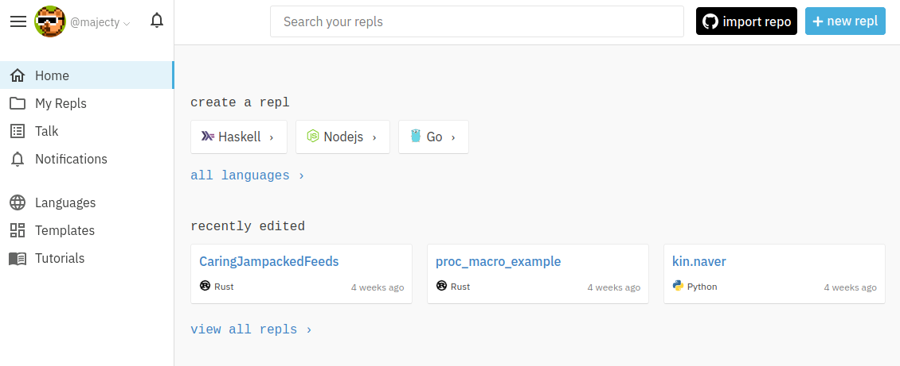
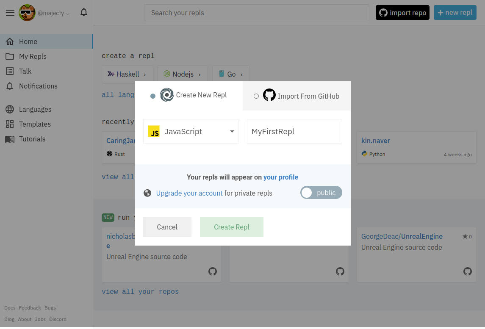
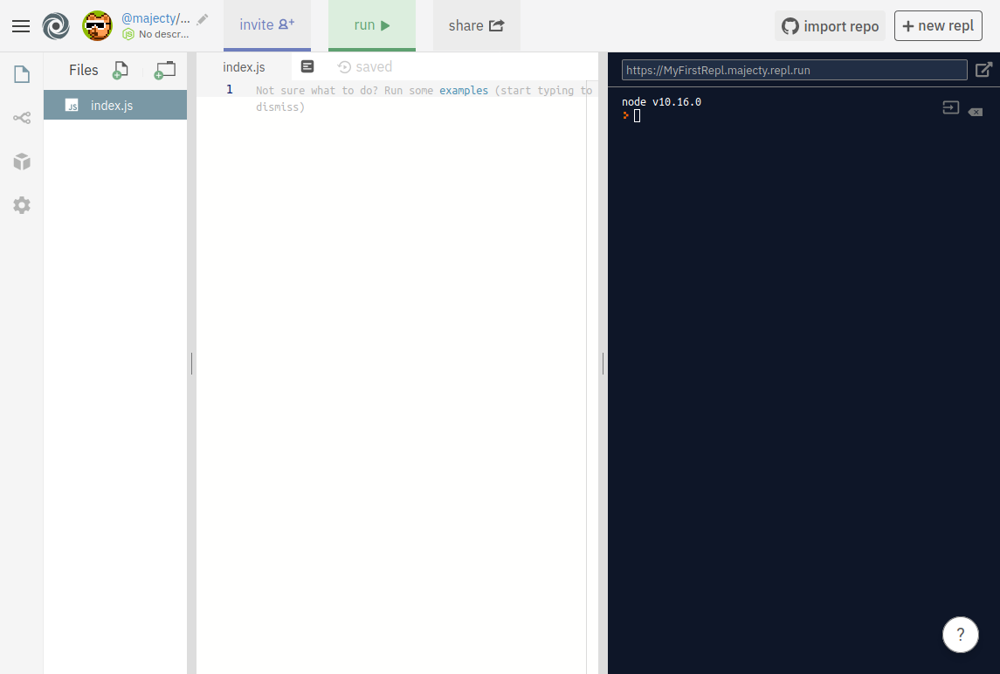
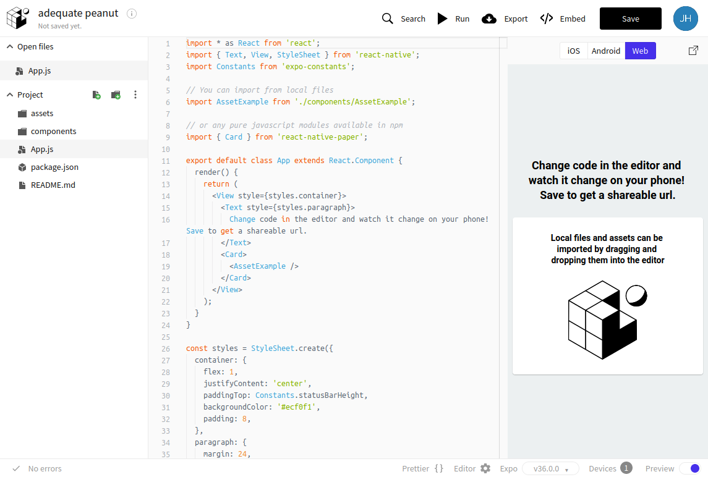
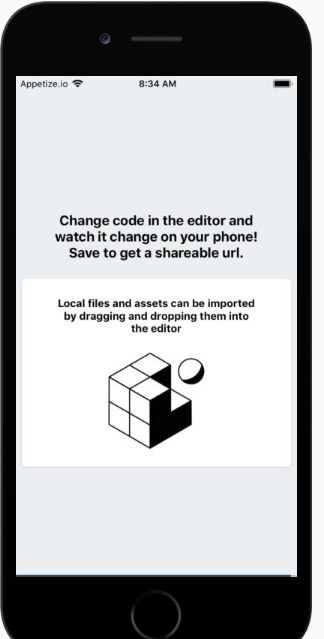

# repl.it과 expo snack 써보기

## repl.it 사용해보기

[repl.it](https://repl.it)에 가입한 뒤 간단한 repl을 하나 만들어보자.
맨 처음 가입하면 다음과 같은 페이지를 볼 수 있다.



오른쪽 위의 "+ new repl" 버튼을 눌러서 새로운 repl을 만들자.



언어는 JavaScript를 선택하고, repl의 이름을 간단하게 지어주자.



replit의 페이지는 크게 세 영역으로 나뉜다. 맨 왼쪽은 파일들을 볼 수 있는 영역이다. 가운데에서 왼쪽은 코드를 쓰는 영역. 맨 오른쪽은 실행 결과를 볼 수 있는 영역이다.

### Hello world in repl.it

다음 코드를 repl.it에 붙여넣고 실행시키자. 위의 "Run" 버튼을 누르면 코드가 실행된다.
단축키로 Ctrl-Enter혹은 Cmd-Enter를 입력해도 실행된다.

[//]: # (복사해서 붙여넣는 것보다 직접 쳐서 써보는 걸 추천, 에러메시지도 직접 봐보고 수정해보는 경험이 필요하다.)

```js
const hiMsg = "Hello World";
console.log(hiMsg);
```

코드를 실행하면 오른쪽 창에 "Hello World"라는 메시지가 출력된다.

## Expo Snack 써보기

Expo를 사용하면 JavaScript로 작성한 앱을 핸드폰에서 바로 실행해볼 수 있다. Expo Snack은 Expo가 제공해주는 웹용 개발 도구다. 첫 프로젝트를 생성해서 핸드폰에서 실행해보자.

먼저 [snack.expo.io](https://snack.expo.io)에 접속하자. 접속하면 다음 화면을 볼 수 있다.



이미 간단한 예시 프로그램이 준비되어있다. UI는 repl.it과 비슷하다. 맨 왼쪽은 파일들을 볼 수 있는 영역, 가운데는 코드는 쓰는 영역, 맨 오른쪽은 결과를 볼 수 있는 영역이다.

Run 버튼을 누르면 QR 코드가 생성된다. 아이폰이라면, 스마트폰의 카메라 앱으로 해당 QR 코드를 인식하자. 인식되면 자동으로 버튼이 뜨는데 해당 버튼을 눌러서 expo 앱으로 이동하자.

성공했다면, 핸드폰에서 예시 이미지와 텍스트를 확인할 수 있다.


