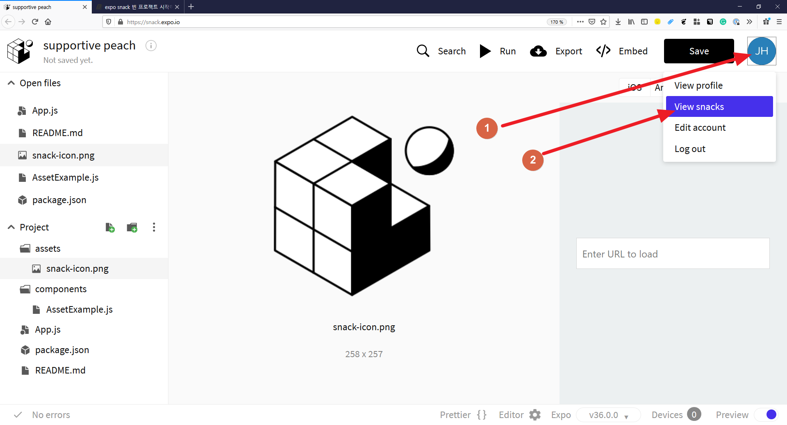
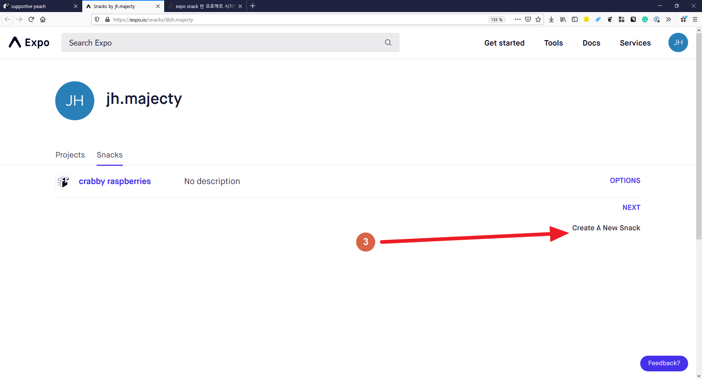
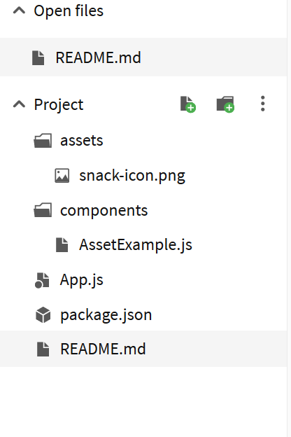

# expo snack 빈 프로젝트 시작하기

## 프로젝트 생성

snack을 처음 키면 예시 프로젝트를 보여준다. 이 창에서 나가 새로운 프로젝트를 만들자.

[https://snack.expo.io](https://snack.expo.io)에 처음 들어가면, 예시 프로젝트 창이 뜬다.
여기서 오른쪽 위 자신 계정의 아이콘(1번)을 눌러서 메뉴를 띄운 뒤 "View snakcs" 버튼(2번)을 누르자.

Snacks 자신이 만든 프로젝트의 목록을 보는 페이지다. 여기서 새로운 프로젝트를 만들자.

화면의 가운데에 "Create A New Snack" 버튼(3번)을 눌러서 새로운 스낵을 만들자.

## 프로젝트 파일들

프로젝트들 만들면 기본 파일들이 생성된다. 간략하게 생성된 파일들이 하는 일을 알아보자.



### README.md 파일

많은 프로젝트들이 프로젝트를 설명하기 위해서 README.md 파일을 사용한다.
프로젝트의 목적, 상태, 사용 법등을 적는 파일이다.

### package.json 파일

JavaScript를 사용해서 프로젝트를 만들 때 많은 경우 사용하는 파일이다.
프로젝트의 이름, 설명, 사용하는 라이브러리(다른 사람이 만든, 재사용할 수 있는 코드) 내용들이 적힌다.

### App.js 파일

React Native 프로젝트의 시작 파일이다. 또한 화면을 그리는 파일이다.
화면을 구성하는 코드와, 화면의 보이는 모습을 설정하는 코드로 나뉘어있다.

#### 화면을 구성하는 코드

```js
export default class App extends React.Component {
  render() {
    return (
      <View style={styles.container}>
        <Text style={styles.paragraph}>
          Change code in the editor and watch it change on your phone! Save to
          get a shareable url.
        </Text>
        <Card>
          <AssetExample />
        </Card>
      </View>
    );
  }
}
```

위 코드가 화면을 구성하는 코드다. `View` 안에 `Text`와 `Card`가 있다. `Text` 안에는 글자가 써져있다.

### 보이는 모습을 설정하는 코드

```js
const styles = StyleSheet.create({
  container: {
    flex: 1,
    justifyContent: "center",
    paddingTop: Constants.statusBarHeight,
    backgroundColor: "#ecf0f1",
    padding: 8
  },
  paragraph: {
    margin: 24,
    fontSize: 18,
    fontWeight: "bold",
    textAlign: "center"
  }
});
```

위 코드가 보이는 모습을 설정하는 코드다. 여백(padding, margin)과 색(backgroundColor). 폰트 사이즈 등을 설정한다.

### assets 폴더

프로젝트에서 소스코드가 아닌 파일들을 별도로 관리한다. 이 프로젝트에서는 assets 폴더 안에 관리한다.
assets 폴더 안에는 이미지 파일이 하나 들어있다.

### components

프로그래밍에서 중요한 이슈가 코드를 어떻게 나눠서 관리하는지다.
완성도 있는 프로젝트는 매우 많은 코드가 필요해서 한 사람이 모든 코드를 이해할 수 없다.
따라서 코드를 잘 나누어서 수정할 때 일부분의 코드만 수정할 수 있어야 한다.
React Native는 Component라는 개념을 사용해서 코드를 나눈다.
컴포넌트는 UI를 구성하는 한 단위다.

### components/AssetExample.js

예시로 들어있는 컴포넌트다. App.js와 비슷하게 화면을 구성하는 코드와 꾸미는 코드가 나누어져 있다.
