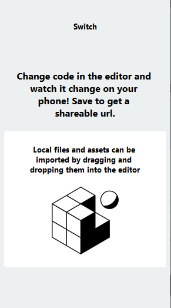

# 새로운 컴포넌트 추가하기

## Switches.js 파일 만들기

components 디렉토리에 "Switches.js" 라는 이름의 파일을 하나 만들자.
아래 코드를 복사해서 붙여 넣거나, 직접 타이핑하자.

```js
// 큰 틀은 AssetExample.js와 똑같다.
import * as React from "react";
import { Text, View, StyleSheet, Image } from "react-native";

// class 키워드 뒤에 Switches 라는 이름을 사용했다.
export default class Switches extends React.Component {
  render() {
    return (
      <View style={styles.container}>
        <Text style={styles.paragraph}>Switches</Text>
      </View>
    );
  }
}

const styles = StyleSheet.create({
  container: {
    alignItems: "center",
    justifyContent: "center",
    padding: 24
  },
  paragraph: {
    margin: 24,
    marginTop: 0,
    fontSize: 14,
    fontWeight: "bold",
    textAlign: "center"
  }
});
```

## App.js에서 Switches 컴포넌트 사용하기

App.js 파일을 열어서 아래 코드처럼 수정하자.

```js
import * as React from "react";
import { Text, View, StyleSheet } from "react-native";
import Constants from "expo-constants";

import AssetExample from "./components/AssetExample";
// 이 아랫줄이 새로 추가되었다. 현재 디렉토리와 같은 위치에 있는
// components 디렉토리에서 Switches 파일의 코드를 불러온다는 의미이다.
import Switches from "./components/Switches";

import { Card } from "react-native-paper";

export default class App extends React.Component {
  render() {
    return (
      <View style={styles.container}>
        {/* 아래 줄을 추가하면 화면에 Switches가 추가된다. */}
        <Switches />
        <Text style={styles.paragraph}>
          Change code in the editor and watch it change on your phone! Save to
          get a shareable url.
        </Text>
        <Card>
          <AssetExample />
        </Card>
      </View>
    );
  }
}

const styles = StyleSheet.create({
  container: {
    flex: 1,
    justifyContent: "center",
    paddingTop: Constants.statusBarHeight,
    backgroundColor: "#ecf0f1",
    padding: 8
  },
  paragraph: {
    margin: 24,
    fontSize: 18,
    fontWeight: "bold",
    textAlign: "center"
  }
});
```

여기까지 따라했다면 아래 그림처럼 결과 화면에 "Switch" 텍스트가 출력된다.


