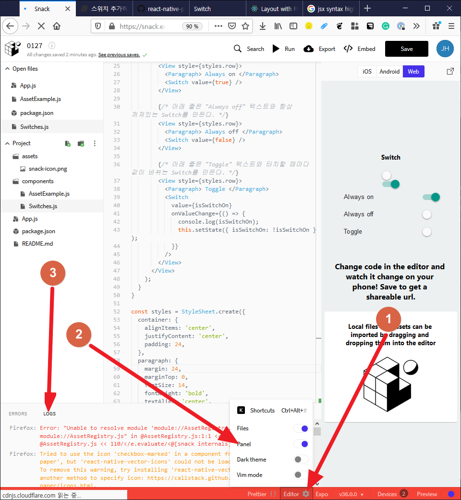

# 스위치 추가하기

스위키 기능을 넣기 위해서 react native paper 라이브러리의 스위치를 사용할 것이다.
스위치는 옵션의 켜짐과 꺼짐을 표현하고 수정할 수 있는 UI 컴포넌트다.
Switch 컴포넌트의 사용법을
이 [링크](https://callstack.github.io/react-native-paper/switch.html)를 읽고 알아보자.

아래는 위 링크에 설명되어 있는 사용하는 예시코드다 천천히 살표보자.

```jsx
import * as React from 'react';
import { Switch } from 'react-native-paper';

export default class MyComponent extends React.Component {
  // state에 isSwitchOn 필드를 선언했다.
  // 기본 값으로 false를 사용한다.
  state = {
    isSwitchOn: false,
  };

  render() {
    // 화면을 그릴 때 this.state에 있는 checked 값을 읽어온다.
    const { isSwitchOn } = this.state;
    return (
      <Switch
        {/* 아래 줄은 isSwitchOn 값을 Switch에 넣어주는 코드다. */}
        value={isSwitchOn}
        {/* 아래 줄은 switch를 터치했을 때 호출되는 코드다. isSwitchOn값을 업데이트한다. */}
        onValueChange={() =>
          { this.setState({ isSwitchOn: !isSwitchOn }); }
        }
      />
    );
  }
}
```

### Switches.js 파일 수정하기

react native paper의 Switch를 우리가 만든 Switches.js 파일에서 사용하자.
아래 코드를 보고 components/Switches.js 파일을 따라서 수정하자.

```jsx
import * as React from "react";
import { Text, View, StyleSheet, Image } from "react-native";

// react-native-paper에 있는 Switches 컴포넌트와 Paragraph 컴포넌트를 불러들인다.
import { Switch, Paragraph } from "react-native-paper";

export default class Switches extends React.Component {
  // 예시코드처럼 state에 isSwitchOn을 추가한다.
  state = {
    isSwitchOn: false
  };

  render() {
    const isSwitchOn = this.state.isSwitchOn;
    return (
      <View style={styles.container}>
        <Text style={styles.paragraph}>Switch</Text>

        {/* 아래 줄은 항상 꺼져있는 Switch를 만든다. */}
        <Switch value={false} />
        {/* 아래 줄은 항상 켜져있는 Switch를 만든다. */}
        <Switch value={true} />

        {/* 아래 4줄은 "Always on" 텍스트와 항상 켜져있는 Switch를 만든다. */}
        <View style={styles.row}>
          <Paragraph> Always on </Paragraph>
          <Switch value={true} />
        </View>

        {/* 아래 4줄은 "Always off" 텍스트와 항상 꺼져있는 Switch를 만든다. */}
        <View style={styles.row}>
          <Paragraph> Always off </Paragraph>
          <Switch value={false} />
        </View>

        {/* 아래 11줄은 "Toggle" 텍스트와 터치할 때마다 값이 바뀌는 Switch를 만든다. */}
        <View style={styles.row}>
          <Paragraph> Toggle </Paragraph>
          <Switch
            value={isSwitchOn}
            onValueChange={() => {
              {
                /* 아래 줄은 Switch를 누를 때마다 현재 상태 isSwitchOn 변수의 값을 출력한다. */
              }
              console.log(isSwitchOn);
              this.setState({ isSwitchOn: !isSwitchOn });
            }}
          />
        </View>
      </View>
    );
  }
}

const styles = StyleSheet.create({
  container: {
    alignItems: "center",
    justifyContent: "center",
    padding: 24
  },
  paragraph: {
    margin: 24,
    marginTop: 0,
    fontSize: 14,
    fontWeight: "bold",
    textAlign: "center"
  },
  row: {
    width: "100%",
    flexDirection: "row",
    alignItems: "center",
    justifyContent: "space-between",
    paddingVertical: 8,
    paddingHorizontal: 16
  }
});
```

### 로그 확인하기

위 코드는 스위치를 누를 때마다 console.log 코드가 실행한다.
Expo snack에서 출력되는 값을 확인하자.



화면 맨 아래의 "Editor" 버튼(1번)을 누르고 Panel switch(2번)를 켜자.
그렇다면 아래 화면에 "ERRORS" 탭과 "LOGS" 탭이 있는 패널이 켜진다.
이 중 "LOGS" 탭을 클릭하자. LOGS탭에서는 출력되는 로그[^로그란]를 볼 수 있다.

화면의 스위치를 누를 때마다 true 혹은 false가 출력되는 것을 확인해보자.

[^로그란]: 프로그래머가 프로그램이 잘 동작하는지 확인하기 위해 프로그램의 상태를

짧은 글로 남기는데 이를 로그라 부른다. 로그를 찍는다. 로그를 프린트한다. 로그를 확인한다.
표현들을 주로 사용한다.
