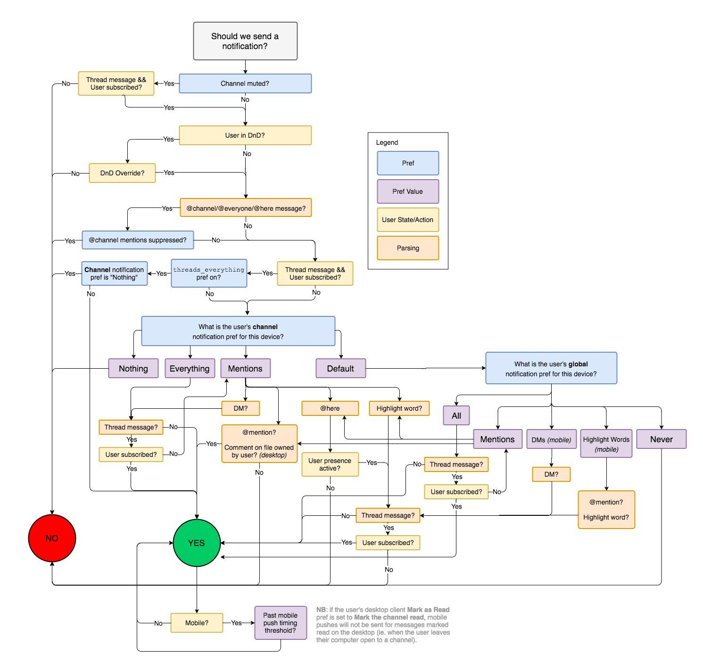

# if문

변수의 값에 따라서 다른 코드를 실행시키고 싶을 때 사용하는 문법이 if문이다.
if문은 조건과 블록으로 구성된다. 조건이 참 값을 가질 때만 블록의 코드를 실행한다.


위 그림은 업무용 메신저로 많이 사용하는 slack이 알람을 보내기 위한 플로우 차트다. 메신저에서 메시지를 받아서 알림을 보내는 기능이 간단할 것처럼 보이나 사용자들의 요구사항을 만족시키기 위해서는 매우 복잡해진다. 프로그래머가 하는 일이 사용자들의 요구사항을 분석해 위와 같은 플로우 차트를 그리고 이를 코드로 표현하는 일이다.

if문의 문법은 간단하나, 실생활의 문제를 if문을 사용해 표현하는 것은 어렵다.

```js
if (true) {
  console.log("이 코드는 실행된다.");
}

if (false) {
  console.log("이 코드는 실행되지 않는다.");
}
```

if문의 조건에는 변수, `true`, `false`, 연산자를 사용한 식 등 결과적으로 값이 나오는 모든 것을 넣을 수 있습니다.

```js
if (1 === 1) {
  console.log("1 === 1");
}

let a = 1 !== 3;
if (a) {
  console.log(a);
}
```

## if-else문

위에서 봤던 if문 보다 조금 더 복잡한 형태로 if-else문을 사용한다. 조건이 `true`라면 if문의 블록을 실행하고, `false`라면 else문의 블록을 실행한다.

```js
let b = true;
if (b) {
  console.log("a === true");
} else {
  console.log("a === false");
}
```

## if-else-if문

여러 조건을 비교하고 싶을 때는 else-if문을 사용한다.
주의할 점은 맨 위에 있는 if문부터 조건을 검사한다는 점이다.
위에서부터 조건을 검사하며, 가장 먼저 만족한 조건의 블록을 실행한다.

```js
let score = 35;
if (score >= 90) {
  console.log("A");
} else if (score >= 80) {
  console.log("B");
} else if (score >= 70) {
  console.log("C");
} else if (score >= 60) {
  console.log("D");
} else {
  console.log("F");
}
```
