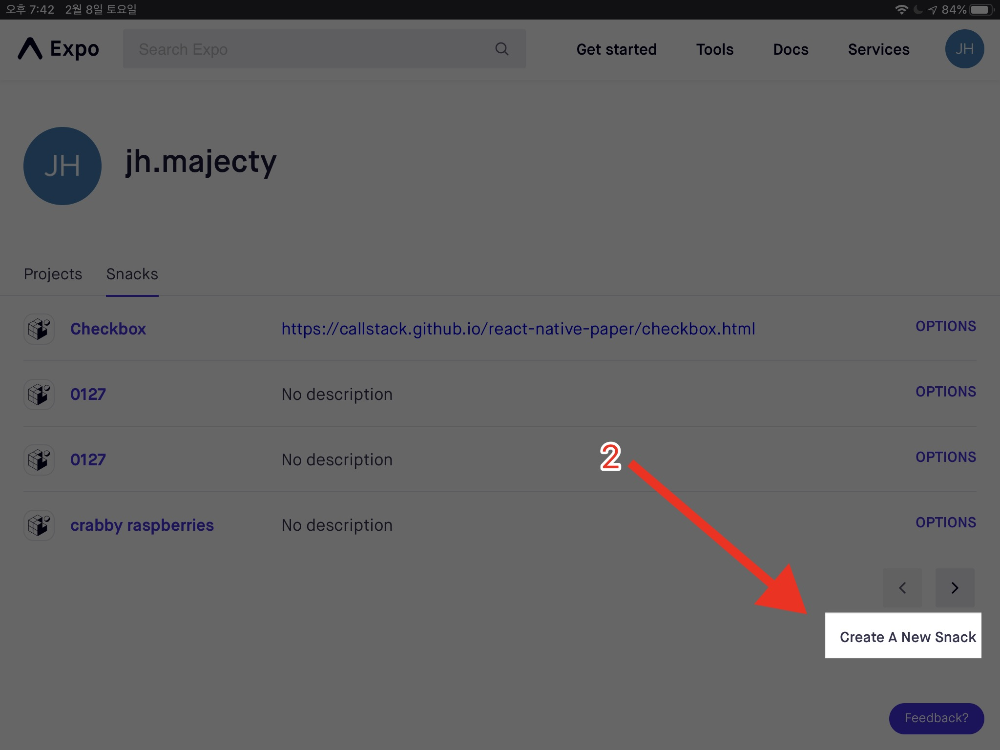

# 새 프로젝트 만들기

새 프로젝트를 [snack.expo.io](https://snack.expo.io)에서 새 프로젝트를 만들자.

## view snacks 로 이동

snack.expo.io에 접속하면 예시 프로젝트가 보인다. 오른쪽 위의 동그란 아이콘을 클릭 후 "view snacks" 버튼을 누르자.

## new snack 이미지

"View snacks" 버튼을 눌렀다면 내가 만든 snack의 리스트를 볼 수 있는 페이지가 뜬다. 오른쪽 아래에 "create a new snack" 버튼을 눌러서 새 스낵을 만들자.

## 스낵의 이름 설정하기

