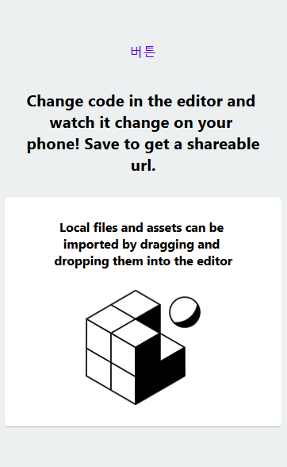

# 버튼 만들기

할일 관리 앱은 할일을 추가하고 삭제할 수 있다.
사용자가 버튼을 눌러서 리스트의 아이템을 추가하거나 삭제할 수 있게 만들자.

## 새로 프로젝트 만들기

이전 [설명](./2-new-project.md)대로 새로운 프로젝트를 만들자.
이 페이지에서 완성할 코드의 [주소](https://snack.expo.io/@jh.majecty/0217-button)다. 따라가다 모르겠으면 참고하자.

## 버튼을 만들자

paper library에서 준비한 버튼을 사용하자. [공식 문서](https://callstack.github.io/react-native-paper/button.html)의 내용을 확인하자.

아래 import 구문을 App.js 파일에 추가하자.

```js
import { Button } from "react-native-paper";
```

"<View style={styles.container}>" 줄 바로 다음에 아래 줄을 추가하자.

```js
<Button> 버튼 </Button>
```

이 상태로 결과를 확인하면 화면의 맨 위에 버튼이 보인다.



## 버튼을 클릭하면 console.log를 찍자

이전에 작성했던 버튼 코드를 다음 줄의 내용으로 교체하자.

```js
<Button onPress={() => console.log('Pressed')}> 버튼 </Button>
```

버튼을 클릭할 때마다 "Pressed"가 로그창에 출력된다. 출력되는 로그를 확인하자.
로그를 확인하는 방법은 [이 링크](../2020-01-27/3-switches.md#로그-확인하기)에 설명되어 있다.