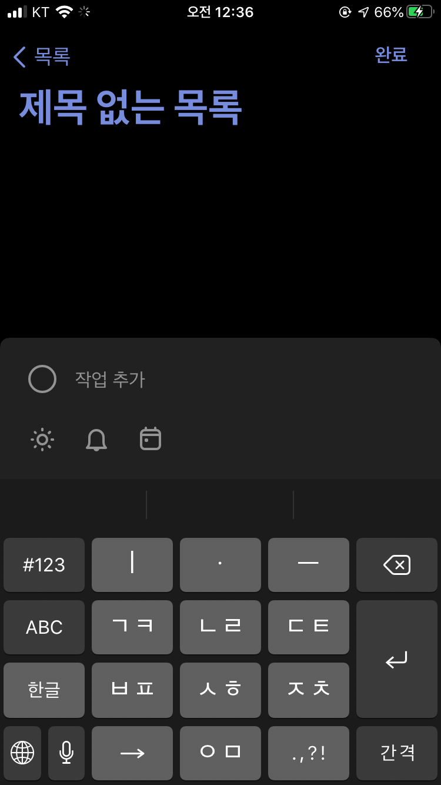
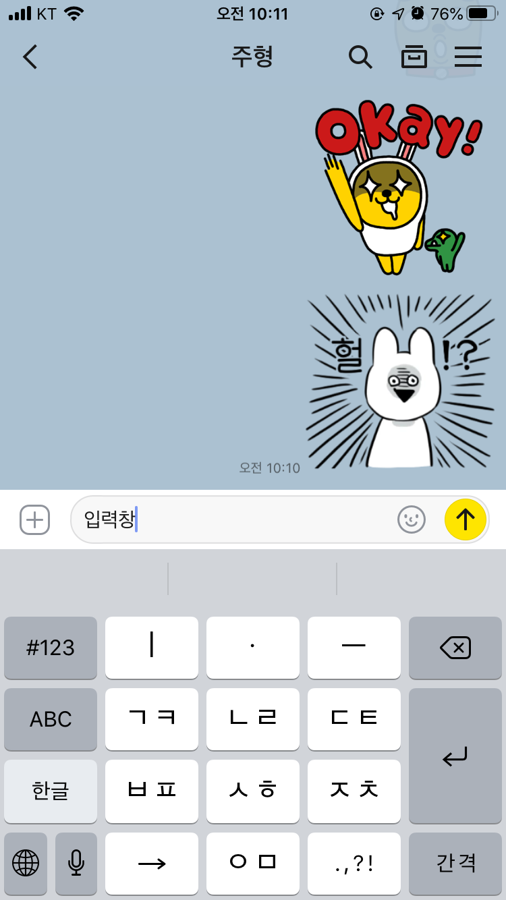
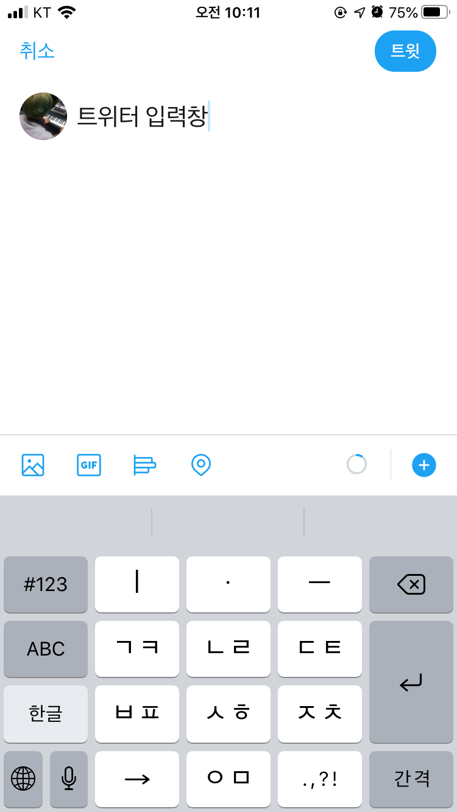

# 입력 유아이

할 일 앱의 유저는 할 일을 추가하기 위해서 짧은 텍스트를 앱에 입력한다.
텍스트 입력 UI를 사용해서 유저로부터 입력을 받아서 할 일을 추가해보자.

## 텍스트 입력의 예시들

위 사진은 마이크로소프트 투두 어플리케이션의 할 일 입력 창이다.
아래의 "작업 추가" 공간에 내가 할 일을 적어 넣을 수 있다.

카카오톡과 트위터 앱도 입력창이 앱에서 중요한 UI 요소이다.

