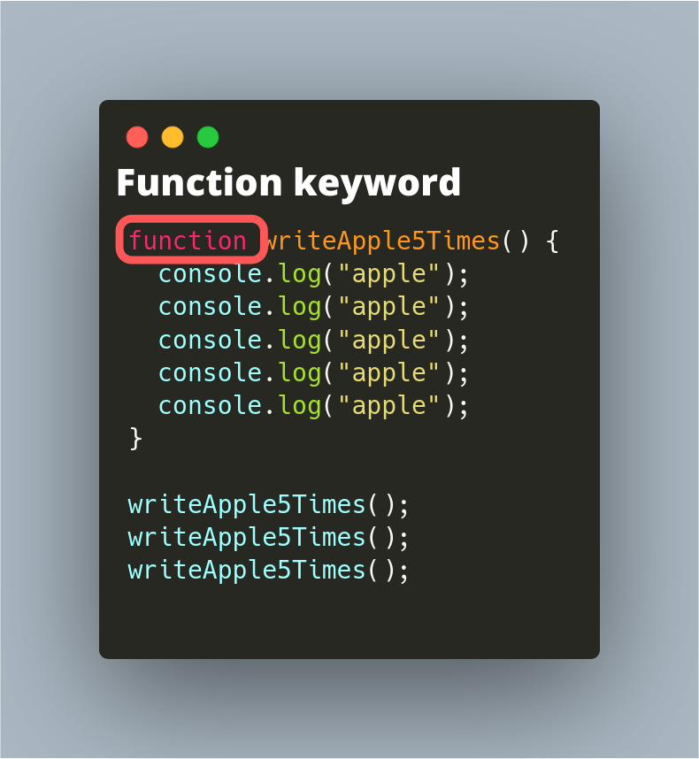
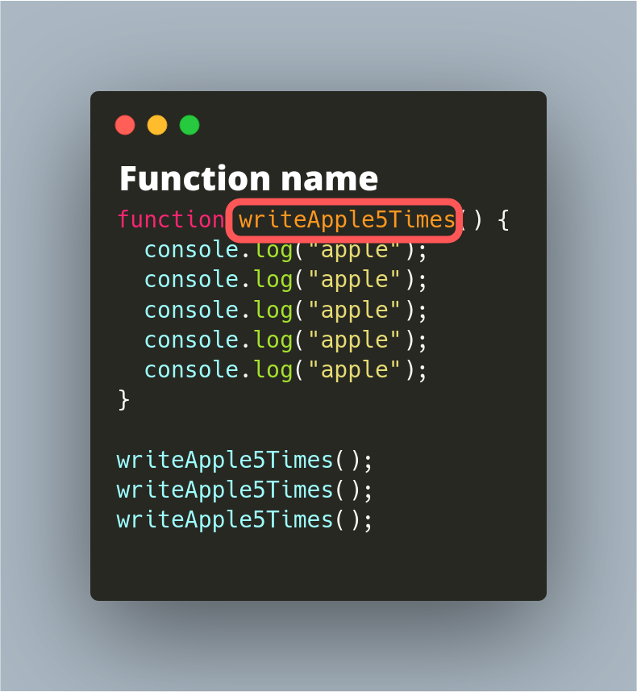
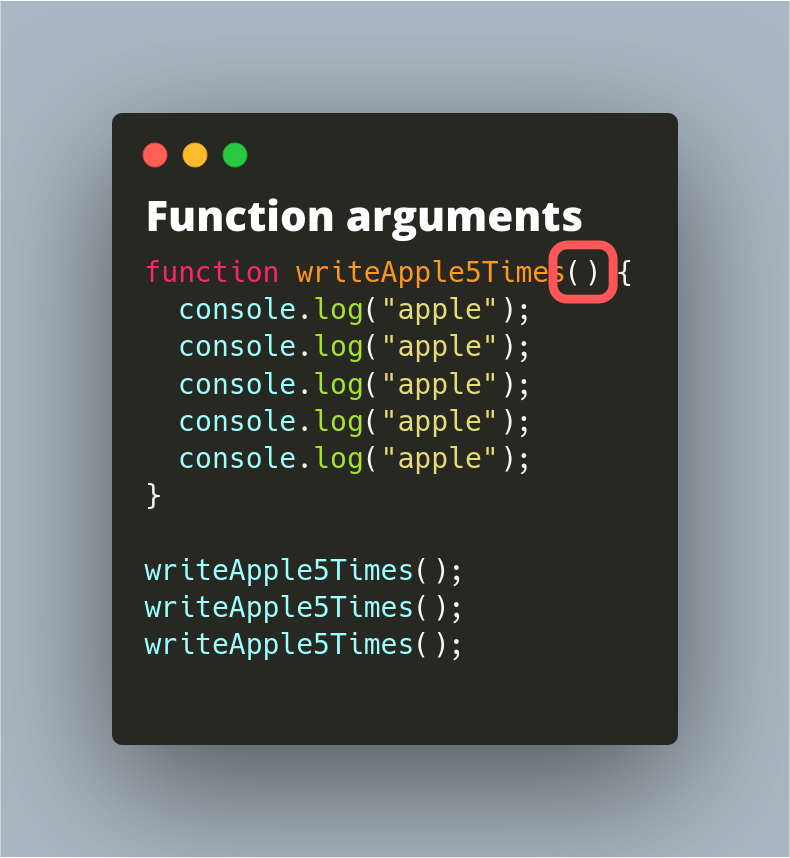
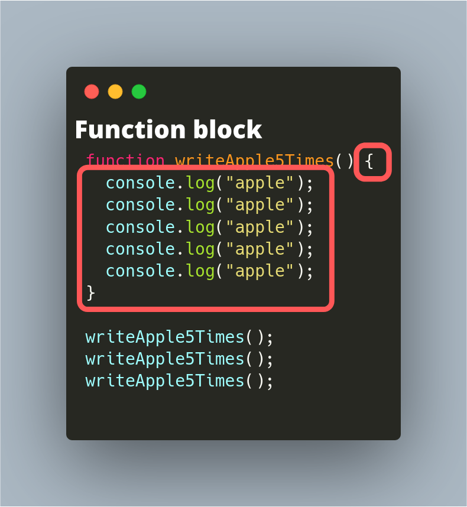
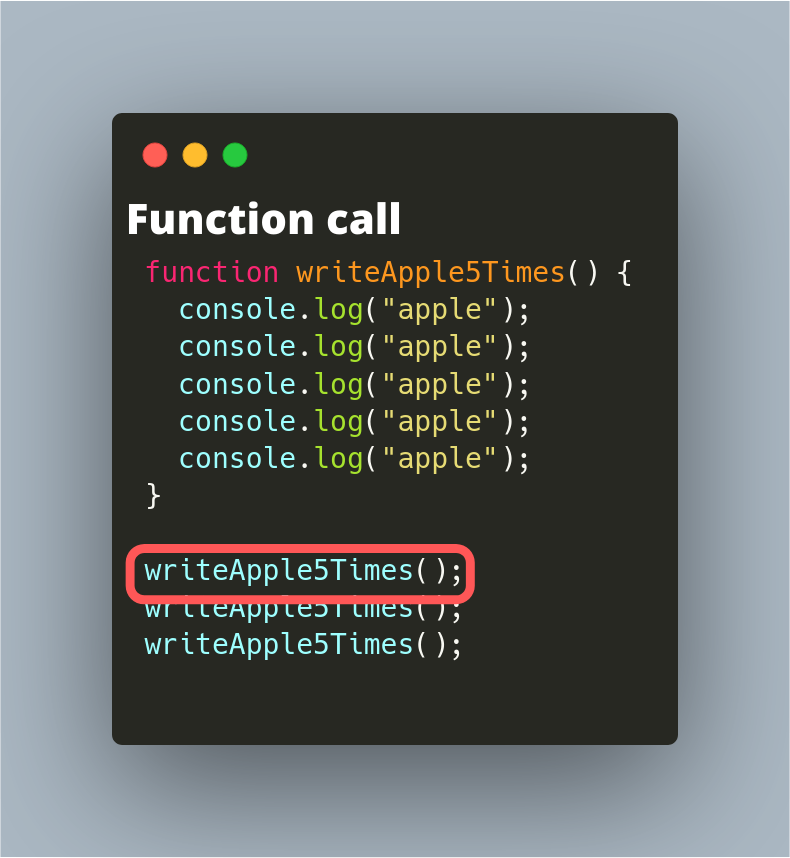
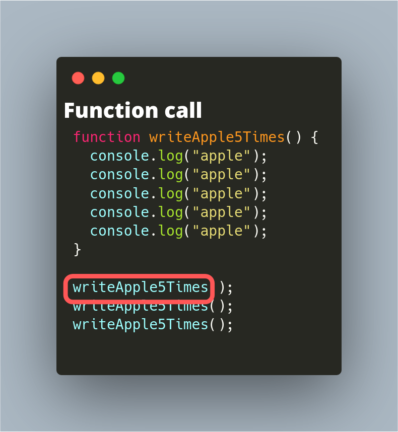
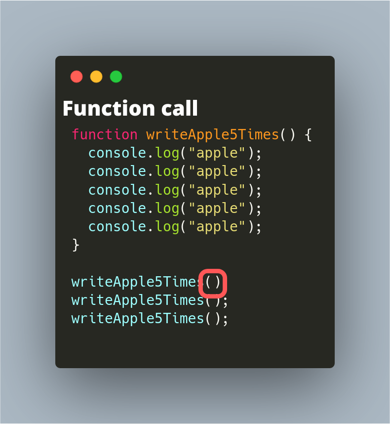

# 함수

함수는 코드의 덩어리다. 변수가 메모리 영역에 이름을 붙여서 원할 때마다 쓰고 읽는 문법이었다면,
함수는 코드 덩어리에 이름을 붙여주고 원할 때마다 똑같은 코드를 실행하는 문법이다.

## 어떻게 동작할까

프로그램을 실행하면 운영체제가 컴파인된 프로그램의 코드를 하드 디스크에서 메모리로 복한다.
각 명령어 한 줄 한 줄은 (코드는 명령어의 집합이다) 메모리의 주소를 할당 받는다.
코드는 앞에서 뒤로 실행하는 게 원칙이지만 필요한 경우 다시 앞으로, 혹은 훨씬 뒤에 있는 코드를 실행할 수 있다.
앞서 공부했던 if문과 for문도 지금 실행하고 있는 명령어 근처의 다른 명령어로 이동하는 방식으로 동작한다.

함수를 사용하면 자주 반복되어 사용하는 코드에 이름을 붙여주고 원할 때마다 실행할 수 있다.

(자세한 동작 원리는 언어의 구현마다 다릅니다. 운영체제나 컴퓨터 구조를 공부하면 더 자세한 동작을 알 수 있습니다.)

## JavaScript 함수 문법

가장 기초적인 함수 문법이다. 아래 코드를 repl.it에 복사해서 실행해보자.

```js
function writeApple5Times() {
  console.log("apple");
  console.log("apple");
  console.log("apple");
  console.log("apple");
  console.log("apple");
}

writeApple5Times();
writeApple5Times();
writeApple5Times();
```

위 코드를 실행하면 apple이 15번 출력된다.
위의 7줄이 함수를 "정의" 하는 코드고, 아래 세 줄이 함수를 "실행"하는 코드다.

### 함수 정의의 구성 요소 1 - function 키워드

함수의 정의는 4가지 구성요소로 이루어져있다. 첫 번째는 "function" 키워드다.


### 함수 정의의 구성 요소 2 - 함수의 이름

두 번째 요소는 함수의 이름이다. 변수의 이름처럼 프로그래머가 편한 이름을 지정해서 사용한다.


### 함수 정의의 구성 요소 3 - 인자

세 번째 요소는 함수의 인자다. 인자에 대해서는 뒤에서 다시 설명한다.


### 함수 정의의 구성 요소 4 - 블록

네 번째 요소는 코드 덩어리인 블록이다. 중괄호로 둘러 쌓여 있는 코드다.


### 함수를 실행하기

함수는 코드 덩어리고, 우리가 원할 때 실행할 수 있는 코드다.
다음 문법으로 함수가 담고있는 코드를 실행한다.
함수를 "호출한다", "실행한다" 둘 다 같은 의미이다.

다음은 함수를 호출하는 문법이다.함수 호출은 "함수이름"과 "인자"의 두 문법 요소로 이루어져 있다.


### 함수 실행의 구성 요소 1 - 함수 이름

함수를 호출은 함수의 이름으로 시작한다. 함수를 정의할 때 사용했던 이름을 그대로 사용하자.


### 함수 실행의 구성 요소 2 - 인자

함수 호출의 두 번째 요소는 인자다. 아직은 인자에 대해서 배우지 않았으므로 "비어있는 인자"인 `()`를 사용한다.

