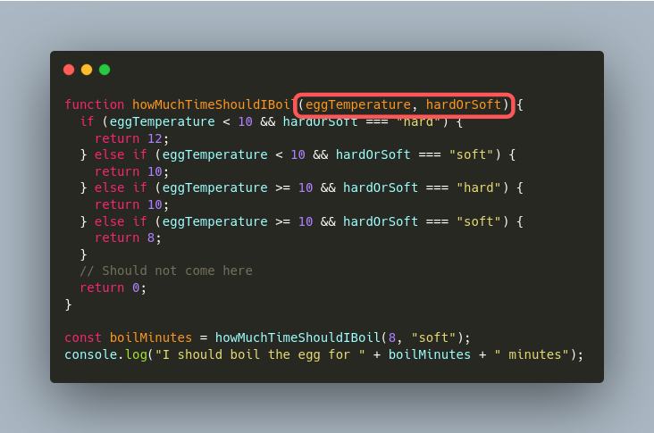

# 함수와 인자

이 앞 문서에서 함수가 코드 덩어리라는 걸 배웠다.
함수를 단순한 코드 덩어리로만 사용해도 유용한 일을 할 수 있다.
하지만, 조금씩 동작을 바뀌는 함수를 만들면 더 유용한 일을 할 수 있다.

## 좋은 함수 만들기

좋은 함수는 하는 일이 명확하고 세부사항을 잘 숨겨야 한다.

아래 함수는 계란을 몇 분 삶으면 원하는 대로 익는지 알려주는 함수다.
이 함수는 계란의 온도와 원하는 삶기 정도를 받아서 몇 분을 삶아야 하는지 알려준다.
이 함수를 호출하는 프로그래머는 실제 계산이 어떻게 이뤄지는지 몰라도 이 함수를 쉽게 쓸 수 있다.
"함수의 구현을 몰라도 쉽게 쓸 수 있다"는 점은 프로그램을 짤 때 매우 중요하다.
충분히 잘 만든 유용한 소프트웨어는 한 사람이 모든 세부사항을 이해할 수 없기 때문이다.

```js
function howMuchTimeShouldIBoil(eggTemperature, hardOrSoft) {
  if (eggTemperature < 10 && hardOrSoft === "hard") {
    return 12;
  } else if (eggTemperature < 10 && hardOrSoft === "soft") {
    return 10;
  } else if (eggTemperature >= 10 && hardOrSoft === "hard") {
    return 10;
  } else if (eggTemperature >= 10 && hardOrSoft === "soft") {
    return 8;
  }
  // Should not come here
  return 0;
}

const boilMinutes = howMuchTimeShouldIBoil(8, "soft");
console.log("I should boil the egg for " + boilMinutes + " minutes");
```


## 인자 문법 뜯어보기

인자는 함수를 호출할 때 함수 밖에서 안으로 넘겨주는 값이며 함수는 이 인자의 값에 따라 다른 일을 한다.
JavaScript 함수의 인자는 `(인자1, 인자2, 인자3, ... 인자n)` 형태를 따른다.

`howMuchTimeShouldIBoil` 함수는 인자로 eggTemperature와 hardOrSoft를 받는다.
`eggTemeperature` 인자는 삶을 계란의 온도를 나타내는 값으로 냉장고에 있던 차가운 계란은 더 오래 삶아야 한다.
`hardOrSoft` 인자는 계란을 얼마나 단단하게 삶을지를 나타내는 값으로 "soft"와 "hard" 두 값 중 하나의 값을 가져야 한다.


### 인자 문법 뜯어보기 - 첫 번째 인자 eggTemperature

첫 번째 인자인 `eggTemperature`가 어떻게 쓰이는지 보자.
함수 `howMuchTimeShouldIBoil`는 첫 번째 인자의 이름을 `eggTemperature`로 명시했다.
함수의 블록 안에는 if문이 있고 if문 안의 조건에서 `eggTemeperature`의 값을 읽는다.

아래 예시 코드는 `howMuchTimeShouldIBoil`함수를 호출할 때 "섭씨 8도"라는 의미로 숫자 8을 집어넣었다.


### 인자 문법 뜯어보기 - 두 번째 인자 hardOrSoft

두 번째 인자인 `hardOrSoft`가 어떻게 쓰이는지 보자.
`howMuchTimeShouldIBoil`함수는 두 번째 인자의 이름을 `hardOrSoft`로 명시했다.
함수의 블록 안에선 if문이 있고 if문 안의 조건에서 `hardOrSoft`의 값을 읽는다.

아래 예시 코드는 `howMuchTimeShouldIBoil`함수를 호출할 때 "반숙"의 의미로 "soft"를 인자로 넣었다.


### 함수의 결과값

함수는 결과값이 있을 수도 있고 없을 수도 있다.
이전 페이지에서 사용했던 사과를 5번 출력하는 함수는 결과값이 없는 함수였다.
`howMuchTimeShouldIBoil` 함수는 함수의 목적이 결과값(몇 분 계란을 끓일 것인가)을 얻는 함수로 결과값이 매우 중요하다.

함수 안에서 return 구문을 사용해서 함수의 결과값을 정한다.
함수 안의 코드를 실행하다가 `return X;`를 만나면, `X`의 값이 함수의 결과값으로 정해지고, 함수의 실행이 끝난다.
`howMuchTimeShouldIBoil(8, "soft")`의 값은 `10`이다.


### 하고 싶은 말

함수에서 바깥쪽에 있는 변수는 되도록 쓰지 말자. 헷갈린다.
