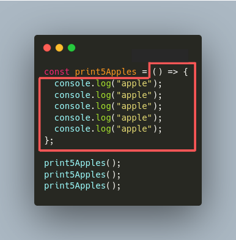
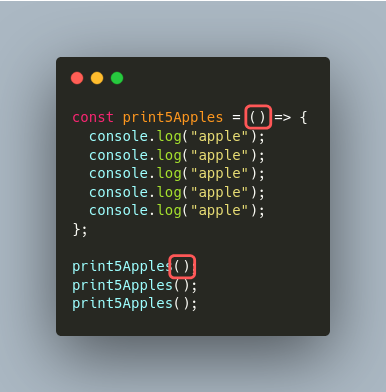
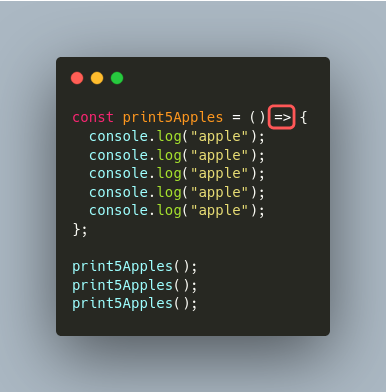
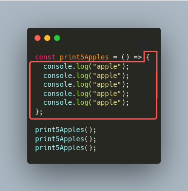
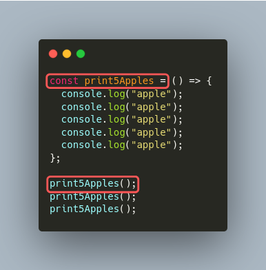

# 이름이 없는 함수

함수의 이름은 중요하지만, 간혹 이름이 없는 함수를 쓸 때가 있다.
저번 시간에 이미 우리는 이름이 없는 함수를 다뤘다.

FlatList UI와 Button UI를 사용하는 코드에 있었던
`({ item }) => <Text>{item}</Text>`와
`() => { console.log("버튼을 눌렀습니다."); }`가 바로 이름이 없는 함수다.

```jsx
<FlatList
  data={this.state.todo}
  renderItem={({ item }) => <Text>{item}</Text>}
  extraData={this.state}
/>
```

```jsx
<Button
  icon="camera"
  mode="contained"
  onPress={() => {
    console.log("버튼을 눌렀습니다.");
  }}
>
```

## 이름이 없는 함수 써보기

다음 코드를 repl에서 실행시켜보자.
사과가 15번 출력되는 걸 확인하자.

```js
const print5Apples = () => {
  console.log("apple");
  console.log("apple");
  console.log("apple");
  console.log("apple");
  console.log("apple");
};

print5Apples();
print5Apples();
print5Apples();
```

## 이름이 없는 함수 뜯어보기

아래 코드에서 빨간색 박스 안에 있는 코드가 이름 없는 함수의 표현식이다.


이름 없는 함수는 세 가지 파트로 이루어져 있다.

## 이름이 없는 함수 뜯어보기 1 - 인자

이름 없는 함수도 이름 있는 함수처럼 인자를 받는다.



## 이름이 없는 함수 뜯어보기 2 - 화살표

이름 없는 함수의 두번째 요소는 화살표다.



## 이름이 없는 함수 뜯어보기 3 - 블록

함수 호출할 때 실행하는 블록이다.



## 이름이 없는 함수 호출하기

이름이 없는 함수는 이름이 없기 때문에 밖에서 이름을 지어주어야 한다.
아래 코드는 이름이 없는 함수를 만든 뒤 변수 문법을 사용해 이름을 지어주었다.



## 이름이 없는 함수 더 간단한 버전

이름이 없는 함수는 블록이 단 하나의 식만 있는 경우 중괄호 `{}`를 생략할 수 있다.
이름이 없는 함수의 인자가 하나 뿐일 때는 소괄호 `()`도 생략할 수 있다.

```js
let areaOfCircle = r => 3.14 * r * r;
console.log("area of circle is " + areaOfCircle(3));
```
