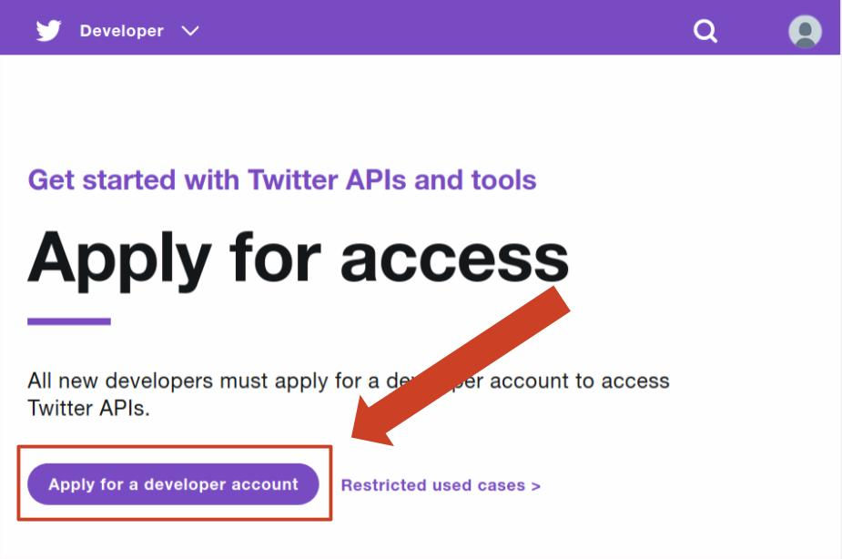
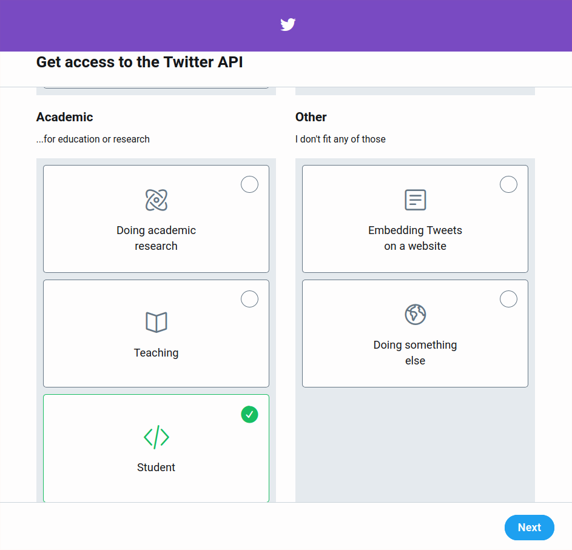
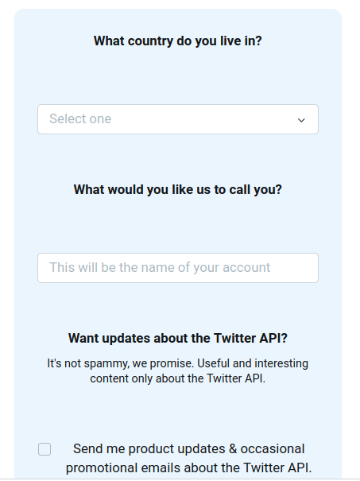
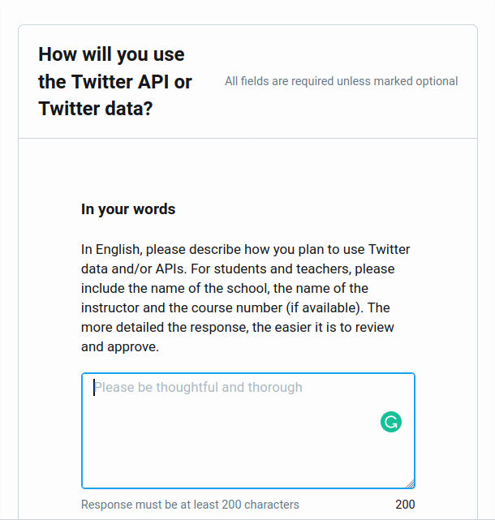
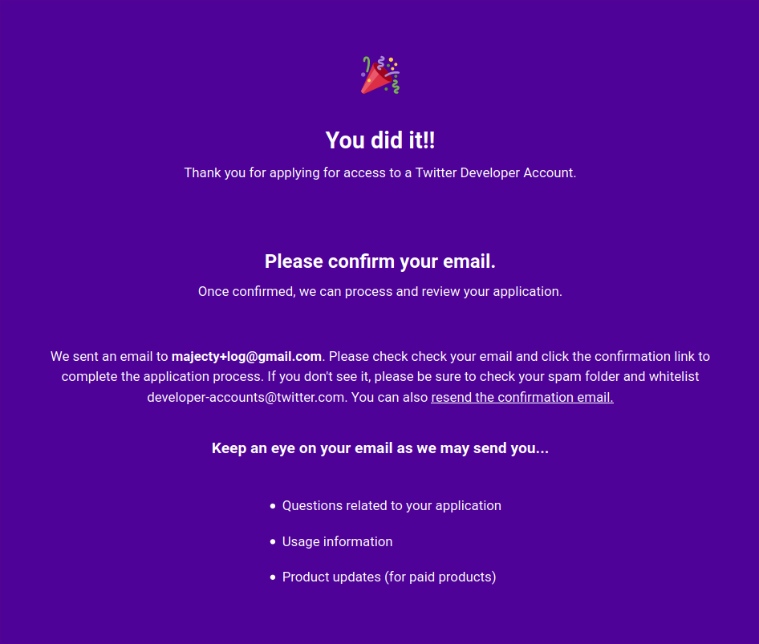

# 트위터 개발자 등록하기

트위터에서 정보를 얻어오려면 트위터에 개발자로 등록해야한다.

## 개발자 등록 페이지 접속

이 [링크](https://developer.twitter.com/en/apply-for-access)에 들어가자.
해당 페이지에서 "Apply for a developer account" 버튼을 누르자.

## 개발자 등록 목적 선택

다음 페이지는 개발자 등록을 하는 목적을 선택하는 페이지다.
취미 개발자를 선택하거나 학생을 선택하자.

## 개인 정보 입력

몇가지 개인정보를 입력해야 한다.

## 사용 목적 적기

트위터에 개발자 등록을 해서 무엇을 하고 싶은지 적는다.
트위터 API를 사용해서 모바일 UI를 공부하고 싶다는 내용을 적자.

## 완료

완료하면 이 페이지가 뜬다.
이 페이지를 확인 후 이메일로 온 Verification 이메일을 확인하자.

