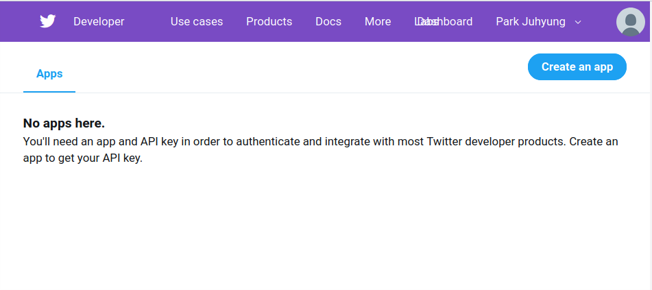
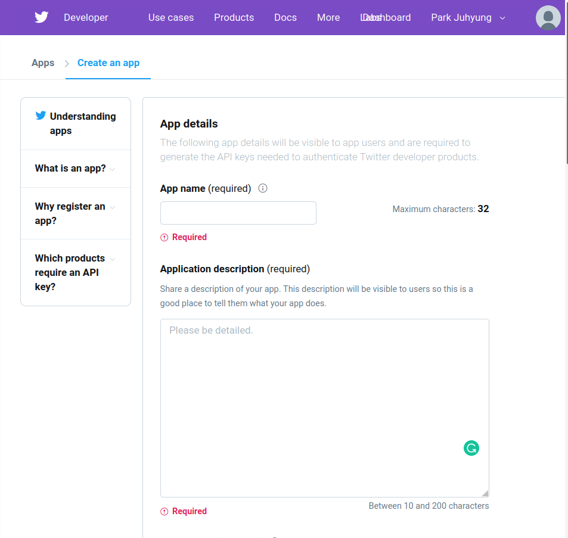
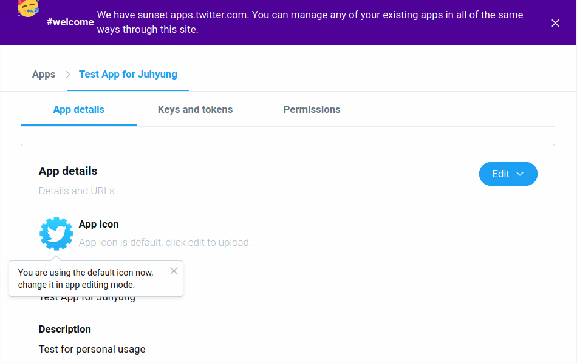

# 앱 만들기

SNS플랫폼들이 유저의 정보를 가지고 광고를 통해 돈을 버는 서비스이기 때문에,
트위터나 페이스북과 갈은 SNS 플랫폼의 정보를 얻는 과정은 까다롭다.
특히 개발자 계정을 악의적으로 사용하여 스팸성 게시글을 많이 올리게 되면, 사용자들에게 큰 불편을 줄 수 있다.

트위터의 개발자 계정은 하나의 회사에 대응된다.
그리고 트위터에서 앱이란 한 회사가 만드는 여러 서비스에 대응된다.

## 트위터의 내 앱 관리 페이지 접속하기

**이** [링크](https://developer.twitter.com/en/apps)에 들어가자.

맨 처음 접속하면 화면에 앱이 하나도 없다.
오른쪽 위의 **"Create an app" 버튼**을 눌러서 새 앱을 만들자.

## 앱의 정보 입력하기

우리는 타임라인을 보여주는 간단한 앱을 만들 것이다. 그 내용을 채워넣자.

## 앱 생성 완료

앱은 만드는데 성공하면 다음 화면이 뜬다.

