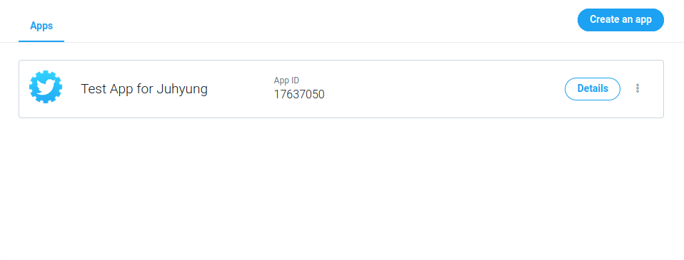
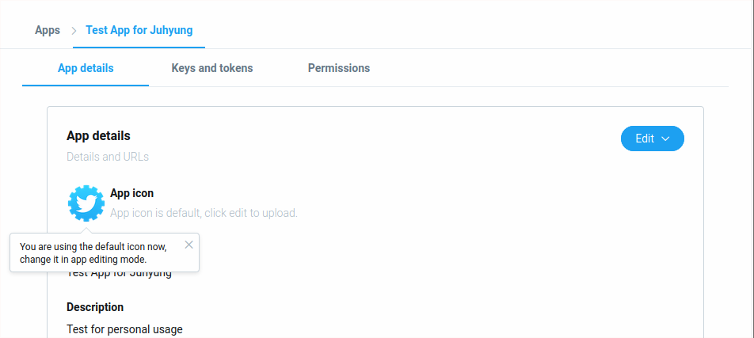
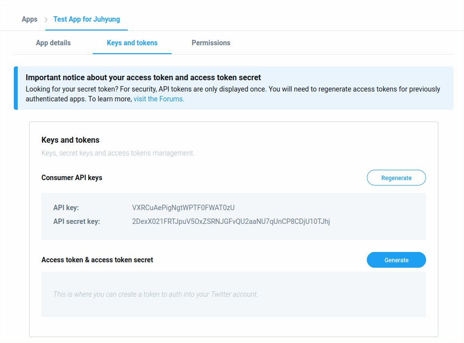

# 앱 컨슈머 API keys와 Access token, Access token secret 확인하기

앱을 생성하는데 성공했으면 다양한 비밀 정보를 트위터가 생성해 준다.
App Consumer API keys, Access Token and Access Token Secret이 비밀 정보들이다.
이 키들은 트위터로부터 데이터를 읽어올 때 일종의 비밀번호처럼 사용한다.
이 키들을 다른 사람이 가져가면 다른 사람이 나인 것처럼 행동할 수 있으므로 조심하자.

## 내 앱 목록 페이지 들어가기

이 [링크](https://developer.twitter.com/en/apps)에 들어가면 내 앱 목록을 볼 수 있다.

"Details" 버튼을 클릭해서 내가 만든 앱의 세부사항 페이지에 들어가자.

## 내 앱 페이지

내 앱 페이지에 들어가면 앱의 상세 내용이 화면에 보인다.

"Keys and tokens" 탭을 클릭하자.

## Keys and tokens

"Keys and tokens" 탭에 들어오면 Consumer API key들과
Access token & access token secret을 페이지에서 확인할 수 있다.
이 들을 어딘가에 잘 백업해두자.

