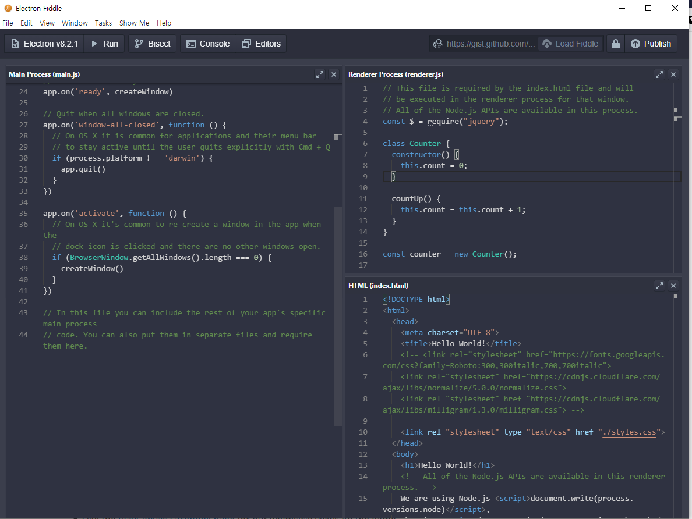
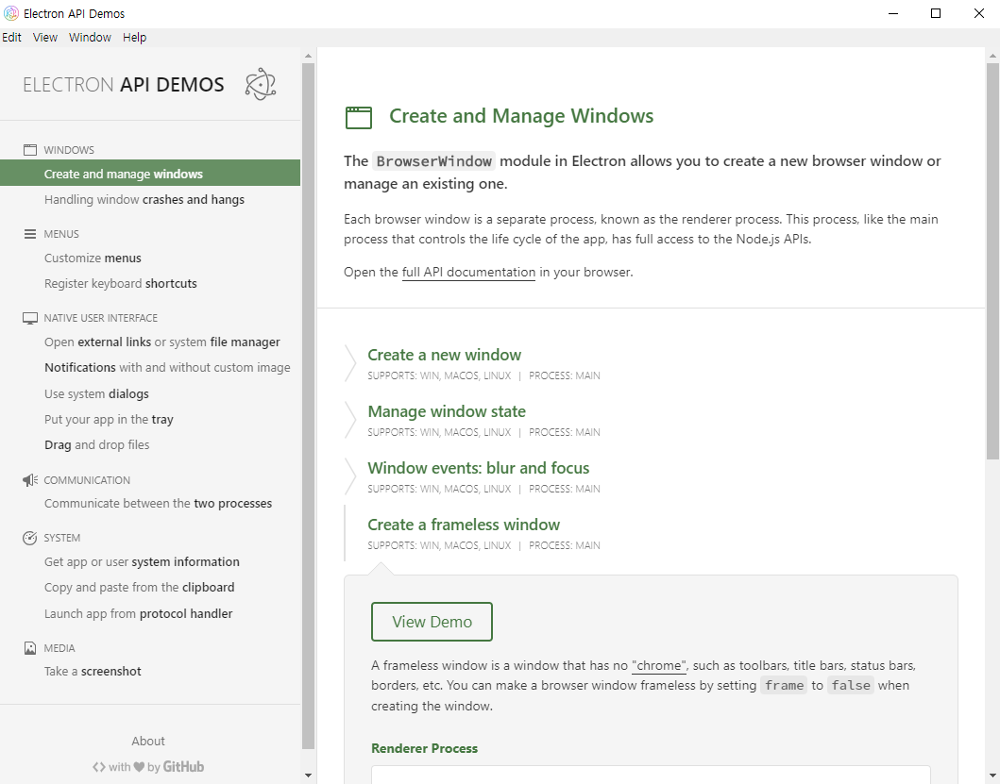

# Counter 만들기

Electron은 한 프로그램에 웹서버, 웹브라우저, 웹페이지를 모두 포함한다.
따라서 서버와 웹페이지에 대한 지식이 있어야 한다. 오늘은 간단한 웹페이지만 만들 것이기 때문에 웹페이지에 대한 배경지식을 쌓자.

## 웹페이지 배경지식

### HTML

웹페이지는 HTML, CSS, JavaScript의 3가지 구성요소로 이루어져있다.

HTML은 HyperText Markup Language의 약자로, 웹페이지의 구조와 내용을 담는 파일이다. HTML 파일은 Header와 Body로 나누어져 있으며, Header에는 웹페이지의 제목이나 웹페이지를 표시하기 위해 필요한 CSS파일과 JavaScript 파일 등 내용에 직접적으로 표현되지 안는 정보를 담는다.
Body에는 웹페이지에 보여질 정보를 구조화해서 담는다.

아래 코드는 매우 간단한 HTML 파일의 예시다.

```html
<!DOCTYPE html>
<html>
  <head>
    <meta charset="UTF-8">
    <title>Hello World!</title>
    <link rel="stylesheet" type="text/css" href="./styles.css">
  </head>
  <body>
    <h1>Hello World!</h1>
  </body>
</html>
```

### CSS

HTML 요소들을 화면에 어떻게 보여줄지 정하는 파일이다.
텍스트의 크기, 색, 여백의 간격 등을 설정한다.

### JavaScript

JavaScript는 웹페이지가 유저와 상호작용하게 만든다.

## Electron Fiddle

Electron Fiddle을 켜면 코드를 수정할 수 있는 창이 3개 뜬다.
왼쪽은 서버 코드 (main.js), 오른쪽 위는 웹페이지에서 사용되는 JavaScript 코드 (renderer.js), 오른쪽 아래는 HTML 파일 (index.html) 이다.



`<F5>` 키를 누르면 우리가 작성한 프로그램이 실행된다. 실행된 프로그램에서 "View" 메뉴 -> "Toggle Developer Tools"를 누르면 크롬 개발자 도구가 화면에 뜬다.
나중에 console.log 코드를 사용하면 개발자 도구에서 확인할 수 있다.

## Electron API Demos

Electron API Demos 프로그램은 Electron으로 할 수 있는 것들을 쉽게 보고 예시 코드를 확인할 수 있다.



클립보드 접근, 파일 저장 다이알로그, 에러 팝업, 알람 기능등을 사용할 수 있다.

## 진짜로 Counter 만들기

### HTML

Electron Fiddle의 HTML 창에 있는 내용을 아래 코드로 바꿔치우자.

```html
<!DOCTYPE html>
<html>
  <head>
    <meta charset="UTF-8">
    <title>Counter</title>
    <link rel="stylesheet" type="text/css" href="./styles.css">
  </head>
  <body>
    <p id="count-text">기본값</p>
    <button id="count-up-button"> CountUp </button>  
    <script>
      // You can also require other files to run in this process
      require('./renderer.js')
    </script>
  </body>
</html>
```

위 코드에서 중요한 곳은 아래 두 줄이다. `p` 태그는 문단을 구분하는 태그다. 문단 하나 하나마다 `p`태그를 사용하는 것을 권장한다. `button` 태그는 버튼이다. 두 태그에 id property를 추가했다. 뒤에서 JavaScript 코드가 이 id를 사용해서 버튼과 `p`태그와 상호작용한다.

```html
    <p id="count-text">기본값</p>
    <button id="count-up-button"> CountUp </button>  
```

### renderer.js

아래 코드를 renderer.js 파일에 붙여넣자.

```javascript
const $ = require("jquery");

class Counter {
  constructor() {
    this.count = 0;
  }

  countUp() {
    this.count = this.count + 1;
  }
}

const counter = new Counter();

$(document).ready(function() {
  console.log("Ready");
  $("#count-text").text(counter.count);

  $("#count-up-button").click(() => {
    console.log("Button clicked");
    counter.countUp();
    $("#count-text").text(counter.count);
  })
})
```

위 코드는 4 영역으로 나뉜다.

첫 번째 영역은 jquery라는 외부 코드를 불러오는 코드다. jquery 라이브러리를 사용하면 쉽게 HTML 코드에 명시된 버튼이나 텍스트를 읽고 수정할 수 있다.

```js
const $ = require("jquery");
```

두 번째 영역은 Counter 클래스를 선언한다.

```js
class Counter {
  constructor() {
    this.count = 0;
  }

  countUp() {
    this.count = this.count + 1;
  }
}
```

세 번째 영역은 Counter 클래스를 사용해서 counter 변수를 선언한다.

```js
const counter = new Counter();
```

네 번째 영역은 버튼이 눌릴 때마다 코드가 동작하도록 만든다.
```js
$(document).ready(function() {
  console.log("Ready");
  $("#count-text").text(counter.count);

  $("#count-up-button").click(() => {
    console.log("Button clicked");
    counter.countUp();
    $("#count-text").text(counter.count);
  })
})
```

### CSS 라이브러리 사용하기

CSS를 하나도 설정하지 않으면 보이는 화면은 매우 어색하다.
기본 버튼이나 텍스트의 폰트등을 설정해주는 CSS 라이브러리들이 많으며 그 중 하나를 사용해보자.

HTML 파일의 header 태그 안에 아래 세 줄을 추가해보자.

```html
    <link rel="stylesheet" href="https://fonts.googleapis.com/css?family=Roboto:300,300italic,700,700italic">
    <link rel="stylesheet" href="https://cdnjs.cloudflare.com/ajax/libs/normalize/5.0.0/normalize.css">
    <link rel="stylesheet" href="https://cdnjs.cloudflare.com/ajax/libs/milligram/1.3.0/milligram.css">
```